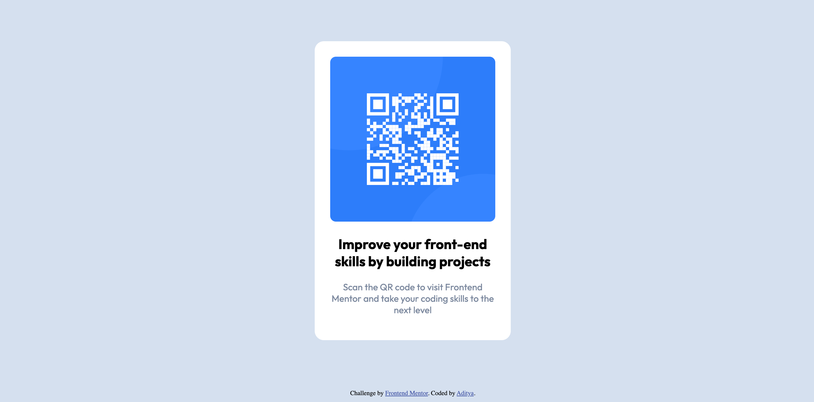

# Frontend Mentor - QR code component solution

This is a solution to the [QR code component challenge on Frontend Mentor](https://www.frontendmentor.io/challenges/qr-code-component-iux_sIO_H). Frontend Mentor challenges help you improve your coding skills by building realistic projects. 

## Table of contents

- [Overview](#overview)
  - [Screenshot](#screenshot)
  - [Links](#links)
- [My process](#my-process)
  - [Built with](#built-with)
  - [What I learned](#what-i-learned)
  - [Continued development](#continued-development)
  - [Useful resources](#useful-resources)
- [Author](#author)
- [Acknowledgments](#acknowledgments)


## Overview

### Screenshot




### Links

- Solution URL: [Add solution URL here](https://your-solution-url.com)
- Live Site URL: [Add live site URL here](https://your-live-site-url.com)

## My process

### Built with

- HTML5
- CSS


### What I learned

I learn about media queries and handling padding and margin.

To see how you can add code snippets, see below:

```html
<div class="card">
    
    <h2>Improve your front-end skills by building projects</h2>
    <p>Scan the QR code to visit Frontend Mentor and take your coding skills to the next level</p>
  </div>
```
```css
@media only screen and (max-width: 667px) {
      .card {
      width: 45%; 
    }
    .attribution {
      margin: 18% auto 0; 
    }
    }
```
```js
const proudOfThisFunc = () => {
  console.log('🎉')
}
```

### Continued development

I think i need to do alot of projects, feeling line i am weak in frontend.


### Useful resources

- [Example resource 1](https://www.w3schools.com - This website is good for leaning new language.
- [Example resource 2](https://www.example.com) - This is an amazing article which helped me finally understand XYZ. I'd recommend it to anyone still learning this concept.


## Author

- Website - [Add your name here](https://www.your-site.com)
- Frontend Mentor - [@yourusername](https://www.frontendmentor.io/profile/yourusername)
- Twitter - [@yourusername](https://www.twitter.com/yourusername)


## Acknowledgments

This is where you can give a hat tip to anyone who helped you out on this project. Perhaps you worked in a team or got some inspiration from someone else's solution. This is the perfect place to give them some credit.

